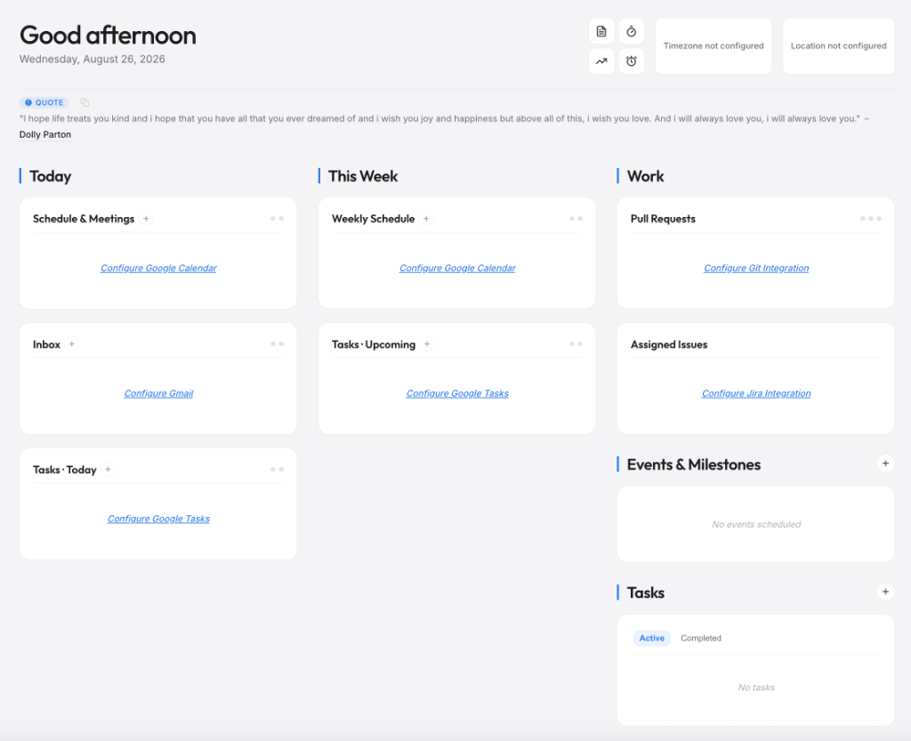
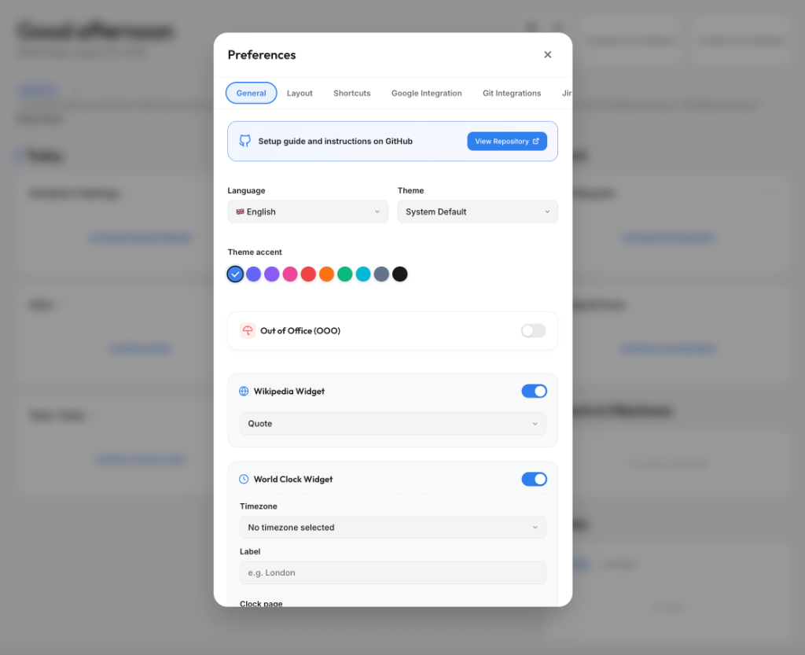

# 🚀 startpage-web

[](https://github.com/hector6872/startpage-web/actions/workflows/build-check.yml)
[](https://github.com/hector6872/startpage-web/blob/main/LICENSE)

A beautiful, modern, and minimalist productivity dashboard featuring task management, calendar schedules, weather forecasts, world clocks, quote & Wikipedia widgets, and seamless integrations with Git (GitHub, Bitbucket, GitLab), Jira, and Google Workspace. ✨

<p align="center">
  
  
</p>

> [!IMPORTANT]
> ### 🔒 100% Local & Privacy-First
> **Privacy is paramount — data never touches any external servers.** This dashboard operates completely client-side:
> - 🚫 **Zero Server Storage**: No data is ever stored on external servers, remote databases, or tracking services.
> - 🛡️ **Private Local Storage in Browser**: All API keys, PATs, tokens, and settings live strictly inside your local browser (`localStorage`).
> - 🔒 **Zero Keys in Exported JSON Files**: Exported and synchronized JSON files are automatically sanitized to never include API tokens or secret credentials.
> - ⚡ **Direct Official API Calls**: All integrations communicate directly from the browser to the official provider APIs (Google, GitHub, Bitbucket, GitLab, Jira).

---

## ✨ Features & Highlights

- 🔒 **100% Local & Privacy-First**: Zero server storage, zero telemetry, and zero remote databases. All configurations and credentials remain strictly on the local device.
- 🌍 **Full Internationalization (10 Languages)**: English (`en`), Español (`es`), Català (`ca`), Français (`fr`), Deutsch (`de`), Italiano (`it`), Português (`pt`), Nederlands (`nl`), 日本語 (`ja`), and 简体中文 (`zh`) with localized date & time formatting.
- 🐙 **Git Pull Requests Aggregator**: Real-time PR/MR tracking across GitHub, Bitbucket, and GitLab with provider indicator dots, automatic reviewer identity detection, and status badges (`Needs Review`, `Changes Requested`, `Conflicts`, `Tasks Open`, `In Review`).
- 📅 **Google Workspace Integration**: Dual account support (Personal & Work) with calendar agenda, priority Gmail inbox, and Google Tasks.
- ✅ **Intelligent Task Scheduling**: Google Tasks sorted chronologically by deadline first (overdue on top), then by most recently updated timestamp.
- 🎯 **Jira Integration**: Displays assigned open issues in real-time with priority badges, issue keys, and direct links.
- 🏖️ **Out of Office (OOO) Mode**: Auto-hides work commitments, tasks, and notification feeds until the selected return date.
- 🎛️ **Customizable Dashboard Layout (Drag & Drop)**: Reorder columns and cards via intuitive drag-and-drop handles directly in Preferences (supports desktop mouse and mobile touch).
- 🌓 **Themes & Customization**: Light, Dark, and System modes with 10 vibrant accent colors.
- 💾 **Flexible Data & Sync**: Private browser local storage or live synchronization with a local/Google Drive JSON file via File System Access API.
- ⚡ **Full Keyboard Accessibility**: Comprehensive WAI-ARIA compliance, modal focus trapping, and single-key shortcuts (<kbd>E</kbd>, <kbd>C</kbd>, <kbd>T</kbd>, <kbd>N</kbd>).

---

## ☁️ Google Cloud Console & APIs Setup Guide

To enable Google Calendar and Gmail integrations on the dashboard, a project in the Google Cloud Console and OAuth 2.0 credentials are required:

### 1. 🏗️ Create a Google Cloud Project
1. Navigate to the [Google Cloud Console](https://console.cloud.google.com/).
2. Log in with a Google account.
3. Click on the project dropdown at the top navigation bar and select **New Project**.
4. Provide a project name (e.g., `Personal Dashboard`) and click **Create**.

### 2. 🔌 Enable Required APIs
The following APIs must be enabled for the dashboard to communicate with Google services:
1. Go directly to the [Google Cloud API Library](https://console.cloud.google.com/apis/library).
2. Search for and enable the following APIs:
   - 📅 **Google Calendar API**
   - ✉️ **Gmail API**
   - ✅ **Google Tasks API**
   - 👥 **People API** (Optional, used for user profile information)

### 3. 🛡️ Configure the OAuth Consent Screen
Before creating credentials, the OAuth consent screen must be configured to define requested permissions:
1. Go directly to the [Google Cloud OAuth Consent Screen Page](https://console.cloud.google.com/apis/credentials/consent).
2. Select **External** (or **Internal** for Google Workspace domains) and click **Create**.
3. **App Information**:
   - Enter **App name** (e.g., `My Startpage`).
   - Select an email address in **User support email**.
   - Scroll to the bottom and enter an email in **Developer contact information**.
   - Click **Save and Continue**.
4. **Data Access / Scopes Step**:
   - In the wizard steps sidebar, navigate to **Data Access** (or **Scopes**).
   - On the **Scopes** page, click the **Add or Remove Scopes** button at the top.
   - In the sliding panel, scroll to the bottom to the section labeled **Manually add scopes**.
   - Copy and paste the following URIs into the text box (comma-separated or one by one):
     ```text
     https://www.googleapis.com/auth/userinfo.email
     https://www.googleapis.com/auth/calendar.readonly
     https://www.googleapis.com/auth/gmail.readonly
     https://www.googleapis.com/auth/tasks.readonly
     ```
   - Click **Add to table**.
   - Ensure the checkboxes next to these scopes are checked in the table.
   - Scroll to the bottom of the sliding panel and click the blue **Update** button.
   - Verify that these scopes appear in the scope tables.
   - Click **Save and Continue**.
5. **Test Users Step**:
   - In the wizard sidebar, navigate to **Audience** (or **Test Users**).
   - Under the **Test Users** section, click **Add Users**.
   - Enter the Google email addresses intended for dashboard access (both Personal and Work Gmail/Workspace accounts).
   - Click **Add** / **Save**.
   - Click **Save and Continue**, then review the summary and click **Back to Dashboard**.

### 4. 🔑 Create OAuth 2.0 Credentials
1. Go directly to the [Google Cloud Credentials Page](https://console.cloud.google.com/apis/credentials).
2. Click **Create Credentials** at the top and select **OAuth client ID**.
3. Choose **Web application** as the Application type.
4. Set a client name (e.g., `Startpage Dashboard`).
5. Under **Authorized JavaScript origins**, click **Add URI** and enter:
   - `http://localhost:5173` (for local development)
   - `https://your-domain.com` (for production)
6. Under **Authorized redirect URIs**, click **Add URI** and enter:
   - `http://localhost:5173/api/auth/google/callback` (for local testing)
   - `https://your-domain.com/api/auth/google/callback` (for production deployments like Cloudflare Pages, Vercel, or Netlify)
7. Click **Create**.
8. Copy the generated **Client ID** and **Client Secret**.

### 5. ⚙️ Configure the Dashboard
1. Open the dashboard in the browser.
2. Click the preferences gear icon (`⚙️`) in the bottom corner.
3. Navigate to the **Google Integration** tab.
4. Fill in the credentials:
   - **Google Client ID**: Paste the Client ID generated above.
   - **Google Client Secret**: Paste the Client Secret (used in production for 100% silent background token renewal without popups).
5. Click **Connect (Personal)** or **Connect (Work)** to authenticate.

> [!NOTE]
> ### 🔄 Hybrid Authentication Architecture
> - **Local Development (`localhost`)**: Runs via fast Google Identity Services (GIS) popups with auto-popup on load if not yet authenticated.
> - **Production (`Cloudflare Pages` / `Vercel` / `Netlify` / `Node`)**: Uses offline Authorization Code flow (`access_type=offline`). Once connected, tokens are renewed 100% silently in the background without any annoying popups.
> - **Zero Server Variables & 100% Privacy-First**: No environment variables are required on the server. All credentials live strictly in your local browser (`localStorage`) and are never sent to external tracking servers or included in exported JSON files.

---

## 🐙 Git Integrations (GitHub, Bitbucket, GitLab)

This dashboard supports aggregating pull requests and merge requests across multiple Git providers.

For each active provider, the dashboard:
* 🔄 Automatically fetches open Pull/Merge Requests from the **5 most recently updated** repositories/projects.
* 🔍 Filters to display teammate PRs/MRs where review is requested (and not yet approved), as well as open PRs/MRs containing **merge conflicts, requested changes, or unresolved discussion threads**.

### ⚙️ Configuration Requirements & Scopes:

- 🐙 **GitHub**:
  - **Inputs**: [Personal Access Token (PAT)](https://github.com/settings/tokens/new?scopes=repo&description=Personal%20Startpage). *(User identity is automatically resolved from `/user`)*.
  - **Required Token Scopes**:
    - `repo` (Full control of private repositories to read PRs and reviews) or a Fine-grained PAT with `Pull requests: Read-only` and `Metadata: Read-only`.

- 🪣 **Bitbucket**:
  - **Inputs**: **Workspace ID** (the slug in the URL `bitbucket.org/<workspace-id>`), **Atlassian Account Email**, and a [Personal API Token](https://bitbucket.org/account/settings/api-tokens/). *(User identity is automatically resolved from `/2.0/user`)*.
  - **Required Token Scopes**:
    - `Account: Read` (`read:user:bitbucket`) — required to resolve user identity (`nickname`, `account_id`) for PR filtering.
    - `Repositories: Read` (`read:repository:bitbucket`) — required to list workspace repositories.
    - `Pull requests: Read` (`read:pullrequest:bitbucket`) — required to read pull requests, reviewers, and approval states.

- 🦊 **GitLab**:
  - **Inputs**: [Personal Access Token (PAT)](https://gitlab.com/-/profile/personal_access_tokens?name=Personal%20Startpage&scopes=read_user,read_api) and optionally a custom **GitLab Host URL** (defaults to `https://gitlab.com` if left empty, supports self-hosted instances). *(User identity is automatically resolved from `/api/v4/user`)*.
  - **Required Token Scopes**:
    - `read_user` — required to automatically retrieve the authenticated username.
    - `read_api` (or `api`) — required to list active projects and merge requests.

---

## 🎯 Jira Cloud Setup Guide

This dashboard integrates with Jira Cloud to display assigned open issues in real-time.

### 1. 🔑 Generate an Atlassian API Token
1. Go directly to [Atlassian Account Security: API Tokens](https://id.atlassian.com/manage-profile/security/api-tokens).
2. Log in with an Atlassian account.
3. Click **Create API token**.
4. In the dialog, provide a label (e.g., `Personal Dashboard`) and click **Create**.
5. Click **Copy** to save the generated API token (displayed only once).

> [!NOTE]
> **No Scopes Required**: Atlassian API tokens generated from `id.atlassian.com` are Basic Authentication tokens tied directly to the Atlassian user account. They do not require configuring individual permission scopes; they automatically inherit the user's existing Jira Cloud permissions (`Browse Projects`, `View Issues`).

### 2. 🌐 Identify the Jira Host URL
The Jira Host URL is the root domain of the Jira Cloud workspace:
- Example: `https://company.atlassian.net` (without any trailing slash or `/jira` suffix).

### 3. ⚙️ Configure the Dashboard
1. Open the dashboard in the browser.
2. Click the preferences gear icon (`⚙️`) in the bottom corner.
3. Navigate to the **Jira Integration** tab.
4. Fill in the required fields:
   - **Jira Host URL**: e.g., `https://company.atlassian.net`
   - **Atlassian Account Email**: The email address associated with the Atlassian account (e.g., `user@company.com`).
   - **Jira API Token**: The API token generated in step 1.
5. Click **Test Connection** to verify credentials. When successful, the button displays **Connected!** and the status dot turns green.

### 4. 📊 Jira Widget Capabilities
- Queries assigned open issues using JQL: `assignee = currentUser() AND statusCategory != Done`.
- Displays up to 5 assigned tasks with:
  - 📝 Issue key & summary (e.g., `[PROJ-123] Fix authentication bug`).
  - 📌 Current status (e.g., `In Progress`, `To Do`).
  - 🏷️ Priority badge (e.g., `High`, `Medium`, `Highest`).
  - 💡 Hover tooltips with complete details.
  - 🔗 Direct links to open each issue in Jira Cloud (`/browse/{KEY}`).
- Includes a live counter badge in the **Work** column header.
- Respects **Out of Office (OOO)** settings with the option to hide Jira tasks while on leave.

---

## 🏖️ Out of Office (OOO) Mode

Under Preferences (`⚙️`) -> General, **Out of Office (OOO) Mode** can be toggled:
1. When enabling OOO, a prompt requests a return date.
2. While OOO is active:
   - 🛑 **Work** events (Gmail, Tasks, Google Calendar) remain hidden from the Today and This Week panels.
   - 🔒 Integrations for **Jira**, **GitHub**, **Bitbucket**, and **GitLab** can be individually configured to hide while OOO is active.
   - 🔴 OOO status is indicated by a red "OOO" badge in the Today and This Week column headers. Clicking this badge opens the General tab in Preferences.
3. OOO mode automatically disables itself on or after the specified return date.

---

## 🎛️ Customizable Dashboard Layout (Drag & Drop)

The dashboard layout and card arrangement can be customized directly from **Preferences (`⚙️`) -> Layout**:

- ↔️ **Column Order**: Rearrange the sequence of columns (*Today*, *This Week*, *Workplace*). Columns flow left-to-right on desktop displays and stack top-to-bottom on mobile devices.
- 📅 **Today Order**: Reorder cards inside the *Today* column (*Schedule & Meetings*, *Inbox*, *Tasks · Today*).
- 🗓️ **This Week Order**: Reorder cards inside the *This Week* column (*Weekly Schedule*, *Tasks · Upcoming*).
- 💼 **Workplace Order**: Reorder subsections in the *Workplace* column (*Work*, *Events & Milestones*, *My Tasks*).
- 🐙 **Work Integrations Order**: Reorder integration cards (*Pull Requests* vs *Jira Issues*).
- 🖐️ **Fluid Drag & Drop**: Native drag handles (`⋮⋮`) with seamless mouse and touch support.
- 💾 **Instant Sync & Persistence**: Changes apply immediately to the dashboard without reloading and persist across sessions via `localStorage` and JSON export backups.
- 🔄 **One-Click Reset**: Restore the default dashboard layout at any time using the *Reset to Default Layout* button.

---

## 🔄 CORS Handling & Multi-Platform Deployment (Jira & Gmail APIs)

Direct browser-to-API calls for **Jira Cloud** (`*.atlassian.net`) and **Gmail** (`gmail.googleapis.com`) typically face CORS restrictions because their endpoints do not return permissive `Access-Control-Allow-Origin` headers for raw browser clients.

To solve this without requiring browser extensions, built-in transparent proxy handlers are included for major deployment platforms:

### 1. 💻 Local Development (`npm run dev`)
- Powered by a custom Vite middleware in [`vite.config.js`](file:///Users/hector.de.isidro/Developer/startpage-web/vite.config.js) under the endpoint `/api/proxy`.
- Requests from `safeFetch()` are proxied on-the-fly to Jira and Gmail with all authentication headers forwarded securely.
- **No browser extensions required.**

### 2. ⚡ Cloudflare Pages
- Powered by Cloudflare Pages Functions in [`functions/api/proxy.js`](file:///Users/hector.de.isidro/Developer/startpage-web/functions/api/proxy.js).
- When deployed to Cloudflare Pages, requests to `/api/proxy` are automatically executed as a lightweight Edge Function that attaches CORS headers and relays HTTPS requests securely.
- Fully serverless, zero maintenance, and works automatically.

### 3. ▲ Vercel
- Powered by Vercel Serverless Functions in [`api/proxy.js`](file:///Users/hector.de.isidro/Developer/startpage-web/api/proxy.js).
- Deploying to Vercel automatically exposes the `/api/proxy` serverless endpoint with zero configuration.

### 4. 💎 Netlify
- Powered by Netlify Functions in [`netlify/functions/proxy.js`](file:///Users/hector.de.isidro/Developer/startpage-web/netlify/functions/proxy.js) with routing configured via [`netlify.toml`](file:///Users/hector.de.isidro/Developer/startpage-web/netlify.toml).
- Transparently proxies requests in Netlify without requiring extra setup.

### 5. 📦 Pure Static Hosting (GitHub Pages, Firebase Hosting, AWS S3)
- Pure static web hosts do not execute serverless functions.
- When deploying to a pure static host, options include:
  - Deploying a free standalone Cloudflare Worker proxy endpoint.
  - Using a browser extension (such as *Allow CORS*).

### 6. 🐳 Self-Hosted Server / Docker (Node.js, Nginx)
- Run `npm run preview` or configure a reverse proxy in Nginx forwarding `/api/proxy` to target services.

---

## ⚡ Quick Actions & Keyboard Navigation

The dashboard is built with first-class accessibility and full keyboard navigation support across the entire app:

### ⌨️ Global Shortcuts

| Shortcut | Action | Destination |
|:---:|---|---|
| <kbd>E</kbd> | ✉️ **Compose Email** | Opens Gmail compose window directly |
| <kbd>C</kbd> | 📅 **Create Event** | Opens Google Calendar event creation |
| <kbd>T</kbd> | ✅ **New Task** | Opens the Quick Task creation modal |
| <kbd>N</kbd> | 📝 **Quick Notes** | Opens the Quick Notes modal |
| <kbd>Esc</kbd> | ❌ **Close Modal** | Closes any open dialog or modal |

> **Note**: Global single-key shortcuts are automatically disabled while typing in text fields, textareas, notes, or when dialogs are active.

### 🧭 Full Keyboard Navigation

- **Sequential Tab Order**: Navigate through all widgets, header buttons, task items, and modals using <kbd>Tab</kbd> and <kbd>Shift + Tab</kbd>.
- **Visible Focus Indicator**: Accessible `:focus-visible` outline rings highlight the active element with clean contrast across dark and light themes.
- **Settings Tabs (WAI-ARIA Pattern)**:
  - <kbd>→</kbd> / <kbd>↓</kbd>: Move to next settings tab.
  - <kbd>←</kbd> / <kbd>↑</kbd>: Move to previous settings tab.
  - <kbd>Home</kbd> / <kbd>End</kbd>: Jump directly to the first or last tab.
- **Accessible Modal Trapping & Restoration**:
  - Tabbing is trapped within open modals to prevent accidental background interaction.
  - When closing a modal, focus automatically returns to the button that opened it.
- **Interactive Widgets Activation**:
  - Activate the World Clock, Weather widget, Upcoming Events banner, or Out of Office badges using <kbd>Enter</kbd> or <kbd>Space</kbd>.
- **Quick Notes Undo / Redo**:
  - <kbd>Ctrl</kbd>/<kbd>Cmd</kbd> + <kbd>Z</kbd>: Undo note changes.
  - <kbd>Ctrl</kbd>/<kbd>Cmd</kbd> + <kbd>Shift</kbd> + <kbd>Z</kbd> (or <kbd>Ctrl</kbd> + <kbd>Y</kbd>): Redo note changes.

---

## 🤝 Contributing

Contributions are always welcome! Please check out the [Contributing Guidelines](./CONTRIBUTING.md) for details on submitting bug reports, suggesting features, and creating pull requests.

---

## 📄 License

This project is licensed under the [MIT License](https://github.com/hector6872/startpage-web/blob/main/LICENSE).

